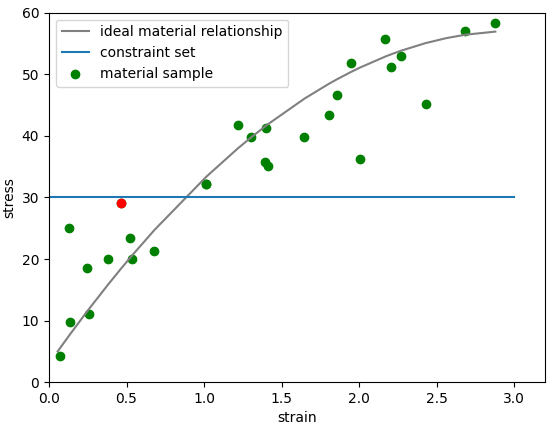

# data-driven
codes written in summer 2021 for data driven computing method

# simple spring bar example:

A simple example used to demonstrate the data driven method is a spring bar setup as follows. The material dataset is used to describe the behavior of the bar and the constraint set reflects the fact that the bar and spring is connected in series thus undergoing the same axial force. As a result at a given spring constant and total displacement there is only a set of points in the phase space that satisfies the relationship. 

The material is assumed to follow a linear relationship with an Gaussian additive nosie during sampling. It is then fit to a Gaussian process and the resulting predction plotted. Altough fitting a GP process to a linear relationship is not of much significance but same code can be used for more complicated material relationship.
The spring is assume to follow Hook's law.

# Bayesian Optimization example:

The below section gives some simple demonstration of the Bayesian optimization process. The algorithm explores the given noisy function according to its acquisition fucntion (Expected improvement in this case) repeadly to find the global minimum. As shown in subplot 1, at first the algorithm explores around. Then as shown in subplot 2 at iteration 20the algorithm converge to keep evaluating points around the minimum. The exploration-exploitation varible xi balances the efficiency and accuracy (to escape local minimum) of the algorithm, as shown in subplot 2 vs 3. The noisier the data the less certain the fitted gaussian process is, as shown in subplot 2 vs 4.

# Iterative minimum distance data driven solver:

This is a simple implmentation of the iterative data driven solver proposed  in the 2015 paper. The algorithm finds the minimum distance to a implicit constraint set based on noisless assumption. Iterative codes have been implemented but in the bar spring case no iteration is needed. The suedocode of the program is as below:

__Require: local data set E (pairs of know material data in the format (ϵ,σ)), applied force F (a scalar value)__

1.  Set k = 0, initial local data assignment:

	Choose 
  randomly from E
  
2.  Solve for u and η by:
  

  
  

  

  
  
 
  
3.  Compute local states:
  

  
  

  

  
  

  
4.  Locate state assignment:

	Choose 
  closest to  in E.
  
5.  Test for convergence:

	__If__ 
  , then:
  

  
  

  
  __Exit__
  
  __Else__
  k←k+1, goto (ii)

  __End if__
	
The distance is defined by the norm 

In the spring bar case, the constraint set is a horizontal line as shown. However this method is prone to be misled by outliers. One example of such is shown below:

