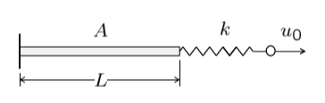
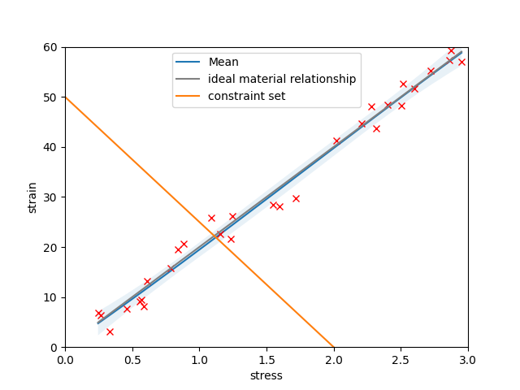
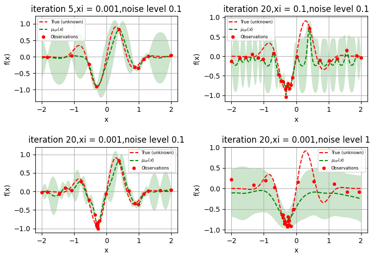

# data-driven
#codes written in summer 2021 for data driven computing method

simple spring bar example:

A simple example used to demonstrate the data driven method is a spring bar setup as follows. The material dataset is used to describe the behavior of the bar and the constraint set reflects the fact that the bar and spring is connected in series thus undergoing the same axial force. As a result at a given spring constant and total displacement there is only a set of points in the phase space that satisfies the relationship. 

The material is assumed to follow a linear relationship with an Gaussian additive nosie during sampling. It is then fit to a Gaussian process and the resulting predction plotted. Altough fitting a GP process to a linear relationship is not of much significance but same code can be used for more complicated material relationship.
The spring is assume to follow Hook's law.

Bayesian Optimization example:

The below section gives some simple demonstration of the Bayesian optimization process. The algorithm explores the given noisy function according to its acquisition fucntion (Expected improvement in this case) repeadly to find the global minimum. As shown in subplot 1, at first the algorithm explores around. Then as shown in subplot 2 at iteration 20the algorithm converge to keep evaluating points around the minimum. The exploration-exploitation varible xi balances the efficiency and accuracy (to escape local minimum) of the algorithm, as shown in subplot 2 vs 3. The noisier the data the less certain the fitted gaussian process is, as shown in subplot 2 vs 4.

