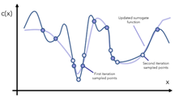
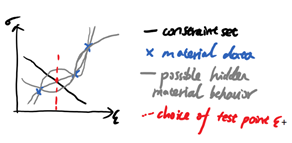
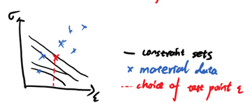
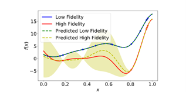

This document records two possible directions we looked at during the summer, as well as some notes taken while catching up with relative knowledge.

### Bayesian optimization:

**1. Background reading:**

The Bayesian optimization is an algorithm aiming to find the local minima/maxima of a function. It is particularly useful if the gradient if unknown and the evaluation at a data point is expensive. Otherwise, gradient descent or simple grid search are also effective algorithms. 

The algorithm replaces the original unknown, expensive function with a cheaper surrogate function, which is usually represents as a Gaussian process. The surrogate function is formed based on sampled points and iteratively updated. The surrogate function is updated by exploring next data point, which is decided through an acquisition function. (prior belief ---information--->posterior belief) The acquisition function needs to strike a good balance between exploration and exploitation, which is exploring known promising regions and high uncertainty regions) Common choice of acquisition functions are expected improvement, maximum probability of improvement and upper confidence bound.

The Gaussian process can be considered as a distribution over random function. It is a stochastic process such that any finite subcollection of random variables has a multivariate Gaussian distribution. If f is a Gaussian process, then for any ,  is multivariate-Gaussian-distributed with mean 0 and covariance K. the kernel, or the covariance K is usually chosen as RBF (radial basis function kernel or squared exponential kernel). It is good with rather smooth and non-periodic data. 

**2. Bayesian optimization in data-driven computing:**

The most general idea is given a material data set, find a way to choose the next desired data point that is most helpful to the algorithm. To evaluate how useful is a new data point, we need something similar to the expected improvement in normal Bayesian optimization. Maybe one of the expressions from the probabilistic data driven scheme chapter? 

Two possible setups: given on phase point z on the constraint set, find the choice of ϵ you want to test so that the new material data point is most likely to be closest to z. One silly way to do this is fit GP model to the existing data then find the intersection of its mean and constraint set. However this seems to violate the data driven paradigm. Need to look up literature to see if there’s better ideas. 

Another setup is given a set of constraint set, find the choice of ϵ you want to explore so that the resulting material data point benefits all of the constraint sets altogether mostly. This new data point tends to be the one that completes the dataset. 

### Multi-fidelity modelling

**1. Background reading:**

Multi-fidelity modelling is the modelling with several different datasets. These datasets can have different quality or simply obtained from different methods. In the simplest case where two dataset of high fidelity (HF) and low fidelity (LF) needs to be merged, it can be done through linear multi-fidelity modelling where 
.  is a GP modelling the output of the low fidelity function, ρ is a factor indicating the magnitude of the correlation to the HF data. 
 is another GP modelling the bias term for HF data. Together this can be modelled as a single GP having the prior:

Perform same Gaussian process optimization as before, fit the function to the new combined dataset and combined kernel. The resulting function would represent predictions from both datasets.

For non-linear multi-fidelity model, the above relationship is revised as fhigh(x) = ρ(flow(x)) + δ(x). It is used to capture the relationship between HF and LF data when it is not linear.

**2.Multi-fidelity in data driven computing:**

A possible setup to the question would be given two sets of data, come up with a way to evaluate the fidelity of the data and incorporate this information in the normal data-driven algorithm.
If we can come up with a way to evaluate/rank the reliability of each data point, this can be somehow normalized and used as a prior in the probabilistic data driven scheme. 

One of the silly ways to do the ranking is fit the high and low fidelity dataset normally to a Gaussian process, rank them according to how far away it is from the mean scaled by standard deviation. But this seems to violate the model free data driven spirit. Another way might be evaluating the liability of a certain material data point z_0 through the algorithm itself. Initialize the dataset with a ranking. Feed z_0 as the target phase point into the algorithm and evaluate the free-energy (or some other values?) relative to other data points. If given the current dataset and ranking the data point z_0 is very likely to occur then it should be given a higher ranking?
