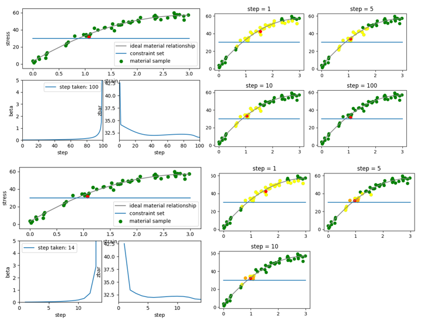

# Max entropy data driven solver:

**code: maxent_solver.py**

This code implements the max entropy data driven solver proposed in the paper. It starts by considering a cluster of data points then gradually narrow down the target through iteration. The code gives a demonstration of how the weight of data points evolve over the time. (Yellow for p>0.01, orange for p>0.1, red for the current weighed average)

_(fig1,2: learning rate = 0.01, fig 3,4: learning rate = 0.1)_

The pusedocode describing the logic of the the program is as followed:

**To be finished**
