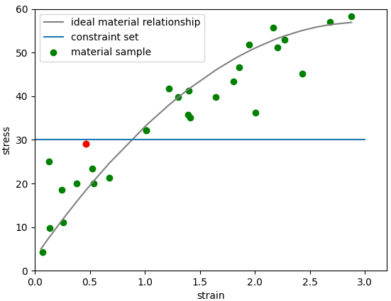

# Iterative minimum distance data driven solver:

**code: data_driven_solver.py**

This is a simple implmentation of the iterative data driven solver proposed  in the 2015 paper. The algorithm finds the minimum distance to a implicit constraint set based on noisless assumption. Iterative codes have been implemented but in the bar spring case no iteration is needed. The suedocode of the program is as below:

__Require: local data set E (pairs of know material data in the format (ϵ,σ)), applied force F (a scalar value)__

1.  Set k = 0, initial local data assignment:

	Choose 
  randomly from E
  
2.  Solve for u and η by:
  

  
  

  

  
  
 
  
3.  Compute local states:
  

  
  

  

  
  

  
4.  Locate state assignment:

	Choose 
  closest to  in E.
  
5.  Test for convergence:

	__If__ 
  , then:
  

  
  

  
  __Exit__
  
  __Else__
  k←k+1, goto (ii)

  __End if__
	
The distance is defined by the norm 

In the spring bar case, the constraint set is a horizontal line as shown. However this method is prone to be misled by outliers. One example of such is shown below:

